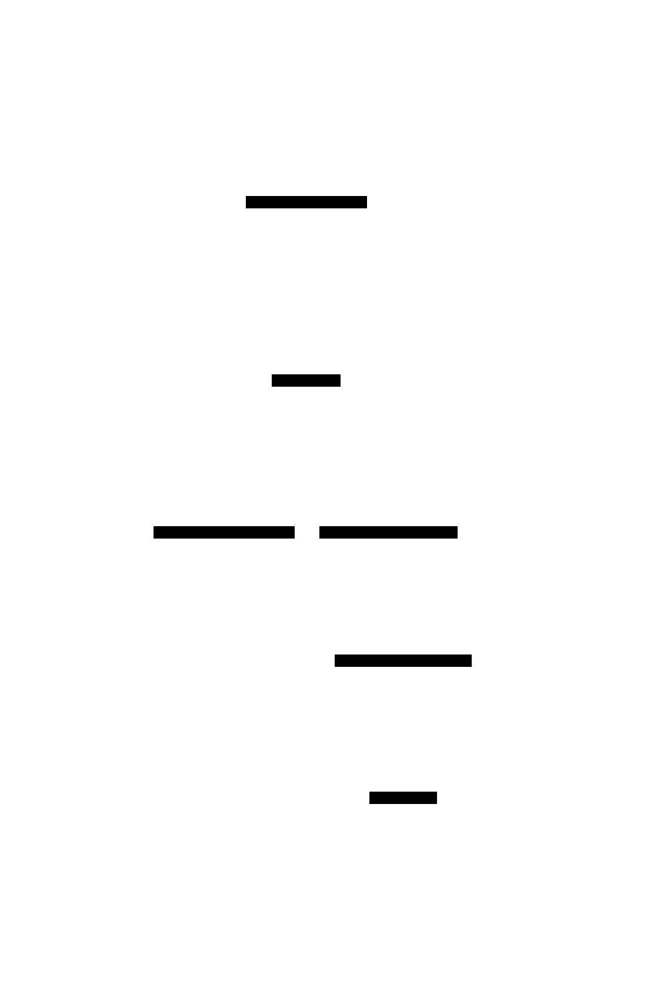
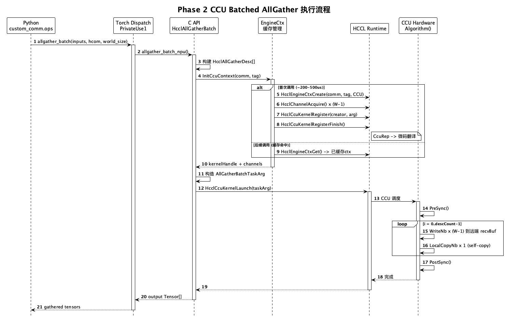
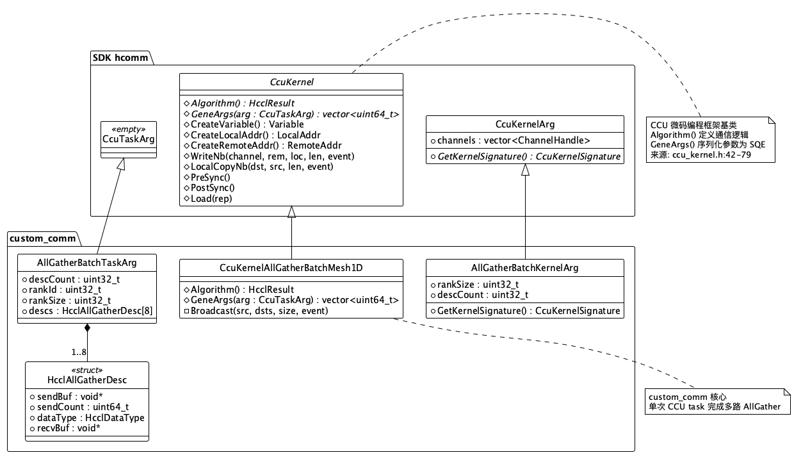
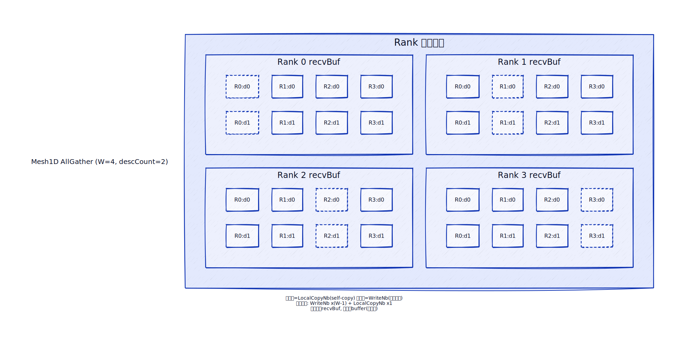

# 需求分析-SRS

## HcclAllGatherBatch

### 介绍

custom_comm 是一个独立的华为昇腾自定义通信算子仓库，目标是以 PyTorch 自定义算子形式端到端交付昇腾亲和的高性能通信算子。首个交付算子: HcclAllGatherBatch（多类型批量 AllGather）。

问题背景（OPT-AG-09）: MoE 量化推理路径对 INT8 数据和 FP32 scale 分别执行独立 AllGather。scale 仅占总数据量约 3%，但每次 AllGather 触发完整的 kernel launch 调度（约 8-10us，design-notes.md:14）。两次独立调用产生约 16-20us 的冗余 launch 开销，且 Python 层的 byte-packing 方案（view-as-uint8 + cat）还引入额外的 HBM 拷贝。

解决方案: HcclAllGatherBatch 在单个 CCU task 内完成多路异构数据类型 buffer 的 AllGather，消除冗余 launch 开销和中间数据拷贝。

范围:
- 仅覆盖 AllGather 集合通信操作
- 支持异构 dtype 输入（如 INT8 + FP32 混合）
- 提供 C API、PyTorch 算子、Python 三层接口
- 支持 eager mode 和 graph mode（aclGraph + GE）

不在范围:
- 不支持 ReduceScatter、AllReduce 等其他集合通信
- 不支持通信与计算融合（如 quant-AllGather fusion）
- 不修改 PTA、HCCL、HCOMM 任何源码

### 输入

#### C API 层

```c
typedef struct {
    void        *sendBuf;    // device memory, 发送缓冲区
    uint64_t     sendCount;  // 元素数量（非字节数）
    HcclDataType dataType;   // 数据类型枚举 (hccl_types.h:90-108)
    void        *recvBuf;    // device memory, 接收缓冲区
} HcclAllGatherDesc;
```

参数约束:

| 参数 | 类型 | 约束 |
|------|------|------|
| descs | const HcclAllGatherDesc* | 非空, 各 desc 的 sendBuf/recvBuf 非空且为 device memory |
| descCount | uint32_t | 1 <= descCount <= MAX_DESC_COUNT (8) |
| comm | HcclComm | 已初始化的 HCCL communicator |
| stream | aclrtStream | 有效的 ACL stream |

各路 desc 允许不同 dataType（异构 dtype 是核心需求），sendCount 可不同。recvBuf 大小需满足: `sendCount * sizeof(dataType) * worldSize`。

#### Torch 算子层

```cpp
custom_comm::allgather_batch(Tensor[] inputs, str hcom, int world_size) -> Tensor[]
```

- inputs: 任意 dtype 的 Tensor 列表，长度即 descCount
- hcom: HCCL communicator group name（通过 `pg._get_backend(torch.device("npu")).get_hccl_comm_name(rank)` 获取，design-notes.md:128）
- world_size: 通信域大小

#### Python 层

```python
gathered = torch.ops.custom_comm.allgather_batch(
    [x_int8, x_scale],  # Tensor[] - 不同 dtype 的 input 列表
    hcom,                # str - group name
    world_size,          # int
)  # -> Tensor[]
```

TORCH_LIBRARY schema 自动生成 Python binding，无需额外 wrapper。

### 处理

三阶段渐进实现:

Phase 1 -- Decomposed 策略（correctness oracle）:
1. 将各路 input tensor view 为 uint8 并 cat 成连续 buffer
2. 调用单次 `HcclAllGatherInner(UINT8)` 完成聚合（pkg_inc/hccl/hccl_inner.h:37, 内部 API）
3. split + view 回原始 dtype，`.contiguous()` 生成连续输出
4. 3 次 kernel launch，额外 HBM 流量约 45MB（W=8, OPT-AG-09 场景，design-notes.md:289）

Phase 2 -- CCU Batched 策略（零拷贝，选定方案）:
1. 注册 `CcuKernelAllGatherBatchMesh1D` 到 HCCL CCU 框架
2. 单 CCU kernel 内逐路执行 `WriteNb * (W-1) + LocalCopyNb * 1`
3. 数据直达远端 recvBuf 目的地址，无中间 buffer
4. 1 次 kernel launch，额外 HBM 流量约 5MB（仅 self-copy，design-notes.md:288）

Phase 3 -- Graph Mode + 优化:
1. 注册 GE converter 支持 `torch.compile` 路径
2. 实现 CaptureSlaveStreams 支持 aclGraph capture
3. 可选: LoopGroup 升级（大消息分块流水线）

Phase 1 不是过渡方案而是永久保留的 correctness oracle: Phase 2 的 bit-exact 正确性以 Phase 1 输出为基准。

### 输出

每路 desc 的输出:
- shape: `[world_size * input_i.shape[0], input_i.shape[1:]]`（dim 0 扩展 world_size 倍）
- dtype: 与对应 input 相同
- memory: 连续 device memory

Torch 层返回 `Tensor[]`，长度等于输入 inputs 的长度。

### 影响性分析

#### 外部依赖

依赖链自底向上:

| 层次 | 依赖项 | 提供能力 | 稳定性 |
|------|--------|----------|--------|
| SDK 头文件 | CANN 9.0.0 --devel | include/hccl/, pkg_inc/hcomm/ccu/ | 公开/内部 |
| C API 实现 | SDK 头文件 + libhcomm.so | HcclAllGatherBatch() | - |
| Torch Extension | C API + PyTorch + torch_npu | torch.ops.custom_comm | - |
| Python Binding | Torch Extension (.so) | Python 可调用接口 | - |
| Graph Mode | Torch Extension + torchair | GE converter, aclGraph | - |

关键外部 API 按 Phase 递增（详见 req-analysis.md:487-505）:
- Phase 1: HcclAllGatherInner (pkg_inc/hccl/hccl_inner.h:37, 内部 API), TORCH_LIBRARY, aclrtSynchronizeStream
- Phase 2: HcclEngineCtxCreate/Get (hccl_res.h:357-369), HcclChannelAcquire (hccl_res.h:330), HcclThreadAcquire (hccl_res.h:297), HcclCcuKernelRegister/Launch (hccl_ccu_res.h:21-28), CcuKernel 基类 (ccu_kernel.h:42-67)
- Phase 3: HcclThreadResGetInfo, aclmdlRICaptureBegin/GetInfo, register_fx_node_ge_converter

注: HcclAllGatherInner 属 hcomm 内部 API (pkg_inc/)，公开的 HcclAllGather 仅存在于 HCCL 主包中（本 SDK hcomm 子包不包含）。选择 Inner 版本的理由: 项目已依赖 hcomm 内部 API (CCU kernel, EngineCtx 等)，增加一个内部 API 的边际风险可控。风险缓解: Phase 1 的 HcclAllGatherInner 调用在 Phase 2 完成后可完全被 CCU 路径替代，届时可移除此依赖。

#### 通用功能影响

日志: 使用 HCCL 已有的日志宏（CHK_RET 模式），不引入独立日志框架。

错误处理: 所有 HCCL API 调用通过宏检查返回值，异常通过 HcclResult 向上传播。Torch 层通过 TORCH_CHECK 将 HcclResult 转为 PyTorch 异常。

资源管理: EngineCtx 通过 HcclEngineCtxGet 幂等缓存，CCU kernel handle 随 EngineCtx 生命周期管理。

#### 涉及场景影响

| 场景 | 影响 | 集成方式 |
|------|------|----------|
| omni-npu AGRS 路径 | 替换 2 次独立 AllGather 为 1 次 allgather_batch | 直接调用 Python API |
| vllm-ascend 量化推理 | TP gather 场景 | 直接调用 Python API |
| torch.compile | 自动识别 allgather_batch op | GE converter 注册 |
| MindStudio profiling | timeline 可见 | RECORD_FUNCTION + aclprofMarkEx |

### 性能分析

OPT-AG-09 典型场景: descCount=2, buf1=2.5MB INT8, buf2=4KB FP32, W=8。

| 指标 | Phase 1 (Decomposed) | Phase 2 (CCU Batched) | 来源 |
|------|---------------------|----------------------|------|
| kernel launch 次数 | 3 | 1 | design-notes.md:287 |
| 额外 HBM 流量 | ~45MB | ~5MB (仅 self-copy) | design-notes.md:289 |
| pack 开销 | ~3us | 0 | design-notes.md:265 |
| unpack 开销 | ~20us | 0 | design-notes.md:265 |
| 端到端额外开销 | ~53us | ~12us | req-analysis.md:385-387 |
| 首次调用初始化 | 无 | ~200-500us (一次性) | req-analysis.md:357 |

运行时不存在 crossover: Phase 2 在所有消息大小下均优于 Phase 1。Phase 1 的不可替代价值在于作为 correctness oracle，以及 Phase 2 CCU 开发风险的 fallback（req-analysis.md:266-268）。

CCU 内部性能模型（alpha-beta）:
- T_phase2 = T_ccu_launch + sum(alpha_i + size_i / BW_link) + T_sync
- T_ccu_launch: ~8-10us（单次，design-notes.md:14）
- T_sync: WaitEvent 同步开销 ~2us（design-notes.md:297）
- BW_link: HCCS 链路带宽（A5 910_95 精确值未确认）

### 约束分析

| 约束类别 | 具体约束 | 来源 |
|---------|---------|------|
| 平台 | A5 (910_95) only | back.txt:4 |
| SDK | CANN 9.0.0, --devel 或 --full 安装 | back.txt:3 |
| 通信机制 | CCU 硬件微码调度 | design-notes.md:32-33 |
| 非侵入 | 不修改 PTA, HCCL, HCOMM | back.txt:5 |
| descCount | 1 <= descCount <= 8 | design-notes.md:423 |
| 内存 | sendBuf/recvBuf 必须是 device memory | HCCL API 约束 |
| 跨平台 | macOS 开发 + aarch64 目标, macOS 仅语法检查 | req-analysis.md:220-227 |
| CCU SQE | 每 SQE 最多 13 个 uint64_t 参数 | ccu_task_param_v1.h:12 |
| API 稳定性 | pkg_inc/ 无跨版本兼容承诺 | design-notes.md:165-166 |

---

# 软件设计-SD

## HcclAllGatherBatch

### 流程描述

#### 模块分解

custom_comm 分为四个逻辑层，每层职责单一:

| 层次 | 目录 | 职责 | 对外接口 |
|------|------|------|----------|
| C API | ops/allgather_batch/ | 通信核心逻辑 + CCU kernel | HcclAllGatherBatch() |
| Torch Binding | torch_ext/csrc/ | PyTorch 算子注册 + dispatch | torch.ops.custom_comm |
| Python | python/custom_comm/ | .so 加载 + 类型提示 | custom_comm.ops |
| Graph Mode | python/custom_comm/converters/ | GE converter + aclGraph | torchair 注册 |

层间依赖严格自顶向下: Python -> Torch Binding -> C API -> SDK。



#### 目录结构

    custom_comm/
    ├── ops/allgather_batch/
    │   ├── inc/                                  # 冻结契约 (header-only)
    │   │   ├── hccl_custom_allgather_batch.h      # C API 声明
    │   │   ├── common.h                           # 共享类型, 错误宏
    │   │   ├── engine_ctx.h                       # EngineCtx 生命周期
    │   │   └── ccu_kernel_ag_batch_mesh1d.h       # CCU kernel 类声明
    │   └── src/                                   # 实现
    │       ├── all_gather_batch.cc                # 入口 + 策略分发
    │       ├── decomposed_strategy.cc             # Phase 1: byte-packing
    │       ├── engine_ctx.cc                      # EngineCtx 管理
    │       └── ccu_kernel_ag_batch_mesh1d.cc      # Phase 2: CCU kernel
    ├── torch_ext/csrc/
    │   ├── ops_registration.cpp                   # TORCH_LIBRARY schema
    │   └── allgather_batch.cpp                    # PrivateUse1 + Meta impl
    ├── python/custom_comm/
    │   ├── __init__.py                            # .so 加载
    │   ├── ops.py                                 # 类型提示
    │   └── converters/
    │       └── allgather_batch_converter.py       # GE converter
    ├── tests/
    │   ├── test_allgather_batch.py                # 功能测试
    │   ├── test_graph_mode.py                     # 图模式测试
    │   └── bench_allgather_batch.py               # 性能基准
    ├── CMakeLists.txt
    ├── cmake/FindCANN.cmake
    └── setup.py

#### Eager Mode 执行流程

Phase 1（Decomposed）:

```text
torch.ops.custom_comm.allgather_batch(inputs, hcom, world_size)
  │
  ├── allgather_batch_npu()           // torch_ext/csrc/allgather_batch.cpp
  │   ├── RECORD_FUNCTION("custom_comm::allgather_batch")
  │   ├── 构造 HcclAllGatherDesc[]
  │   └── HcclAllGatherBatch(descs, descCount, comm, stream)
  │       │                           // ops/.../all_gather_batch.cc
  │       ├── 检查 CUSTOM_COMM_USE_CCU 环境变量
  │       └── DecomposedAllGatherBatch()
  │           │                       // ops/.../decomposed_strategy.cc
  │           ├── view-as-uint8 + cat → packed_buf
  │           ├── HcclAllGatherInner(packed_buf, recv_buf, packed_count, UINT8, comm, stream)
  │           └── split + view + contiguous → outputs
  └── return outputs
```

Phase 2（CCU Batched）:

```text
HcclAllGatherBatch(descs, descCount, comm, stream)
  │                                   // ops/.../all_gather_batch.cc
  ├── InitCcuContext(comm)            // 首次: Create, 后续: Get
  │   ├── HcclEngineCtxGet(comm, tag, COMM_ENGINE_CCU, ...)
  │   │   └── 命中 → 返回已缓存的 ctx
  │   └── 未命中 →
  │       ├── HcclEngineCtxCreate(comm, tag, COMM_ENGINE_CCU, sizeof(CcuCtx), &ctx)
  │       ├── HcclChannelAcquire(comm, COMM_ENGINE_CCU, channelDescs, descCount, channels)
  │       ├── HcclThreadAcquire(comm, COMM_ENGINE_CCU, 1, notifyNum, &threadHandle)  // hccl_res.h:297
  │       ├── channels → AllGatherBatchKernelArg.channels → CcuKernel::channels_  // ccu_kernel.h:145
  │       ├── HcclCcuKernelRegister(comm, &handle, creator, &arg)
  │       └── HcclCcuKernelRegisterFinish(comm)
  │
  ├── 构造 AllGatherBatchTaskArg (继承 CcuTaskArg)
  │   └── 填充: descs[], descCount, rankId, rankSize
  │
  └── HcclCcuKernelLaunch(comm, threadHandle, kernelHandle, &taskArg)
      │
      └── CCU 硬件调度 CcuKernelAllGatherBatchMesh1D::Algorithm()
          ├── // 入口同步由 stream ordering 保证（Launch 在用户 stream 上）
          ├── for i in 0..descCount-1:
          │   ├── WriteNb(channel[j], remoteAddr, localAddr, size, event[i])  // j=0..W-2
          │   └── LocalCopyNb(selfDst, selfSrc, size, event[i])              // self-copy
          └── for i: WaitEvent(event[i])  // 等待所有 WriteNb/LocalCopyNb 完成
```



#### Graph Mode 执行流程

GE 路径（torch.compile）:

```python
@register_fx_node_ge_converter(torch.ops.custom_comm.allgather_batch.default)
def convert_allgather_batch(inputs, hcom, world_size, meta_outputs=None):
    group_name = get_group_name_and_record(tag, rank_list, group_size)
    return [ge.custom_op("AllGatherBatch", ...)]
```

aclGraph capture 路径（design-notes.md:545-556）:

```text
1. PTA 主流发起 aclmdlRICaptureBegin
2. HcclAllGatherBatch 入口检测 capture 状态 (aclmdlRICaptureGetInfo)
3. HcclThreadResGetInfo 获取 CCU thread 绑定的 slave stream
4. rtStreamAddToModel 将 slave stream 添加到主流 model
5. HcclCcuKernelLaunch 在 slave stream 上的操作自动被录制
```

待确认项:
- Tensor[] 在 GE converter 中的映射方式（可变长度 input list 如何映射多个 GE 输入）
- ge.custom_op 能否调度 CCU kernel
- HcclThreadResGetInfo 在 CANN 9.0.0 中的可用性（文档标注 V100R001C17 Eco 版本新增，design-notes.md:555）

### 数据描述



#### C API 数据结构

```c
// ops/allgather_batch/inc/hccl_custom_allgather_batch.h

#define MAX_DESC_COUNT 8  // 与 Mesh1D rankSize 上限对齐 (design-notes.md:423)

typedef struct {
    void        *sendBuf;    // device memory
    uint64_t     sendCount;  // 元素数量
    HcclDataType dataType;   // hccl_types.h:90-108, 17种类型 (值 0-12 + 14-17, 跳过 13)
    void        *recvBuf;    // device memory, 大小 = sendCount * sizeof(dataType) * worldSize
} HcclAllGatherDesc;
```

#### CCU Kernel 参数结构

CcuTaskArg 是空基类（ccu_task_arg_v1.h:12-16），需自定义子类:

```cpp
// ops/allgather_batch/inc/common.h

struct AllGatherBatchTaskArg : public hcomm::CcuTaskArg {
    uint32_t                 descCount;
    uint32_t                 rankId;
    uint32_t                 rankSize;
    HcclAllGatherDesc        descs[MAX_DESC_COUNT];
};
```

#### GeneArgs 序列化

GeneArgs() 将 AllGatherBatchTaskArg 序列化为 `vector<uint64_t>`，供 CCU 硬件通过 SQE 传递:

编码方案: 固定头部 1 slot (RDMA token) + 每路描述符 4 slots。rankSize 通过编译期 CcuKernelArg 固化，descCount 通过 sendBytes==0 跳过替代显式传递。

| slot 偏移 | 内容 | 说明 |
|-----------|------|------|
| 0 | token | RDMA 访问凭证，从首个 active desc 获取 |
| 1+i*4 | sendAddr | 第 i 路发送地址 |
| 2+i*4 | recvAddr | 第 i 路接收缓冲区基址 |
| 3+i*4 | sendBytes | sendCount * elemSize, Host 侧预计算; 0 表示未使用 |
| 4+i*4 | selfOffset | rankId * sendBytes, Host 侧预计算 |

SQE 拆分分析（CCU_SQE_ARGS_LEN = 13, ccu_task_param_v1.h:12）:

| descCount | 总 slots | SQE 数 | 说明 |
|-----------|---------|--------|------|
| 1 | 5 | 1 | 单 SQE 容纳 |
| 2 | 9 | 1 | 单 SQE 容纳 |
| 4 | 17 | 2 | 1 次 SQE 拆分 |
| 8 | 33 | 3 | 2 次 SQE 拆分 |

相对初始设计 (51 slots / 4 SQEs) 的优化: Host 预计算 sendBytes 和 selfOffset 消除了 CCU 侧乘法; token 替代 descCount/rankId/rankSize 头部减少 2 slots; 移除 dataType 和 reserved 字段各省 1 slot/desc。总计从 4 SQEs 降至 3 SQEs，减少硬件调度开销。

SQE 拆分由 CcuKernel::GeneTaskParam()（ccu_kernel.h:59）自动处理。

#### EngineCtx 缓存结构

```cpp
// ops/allgather_batch/inc/engine_ctx.h

struct CcuContext {
    CcuKernelHandle kernelHandle{};   // 注册后的 kernel 句柄
    ThreadHandle    threadHandle{};   // CCU thread 句柄
    bool            initialized = false;  // 全部步骤成功后置位
};
```

EngineCtx 通过 HcclEngineCtxCreate/Get 以 (comm, ctxTag) 为 key 做幂等缓存。ctxTag 字符串格式: `"custom_comm_ag_batch"`。首次调用创建并注册 CCU kernel，后续调用命中缓存直接返回。

#### CcuKernelArg 子类

CcuKernelArg 基类包含 `vector<ChannelHandle> channels`（ccu_kernel_arg.h:23）:

```cpp
// ops/allgather_batch/inc/ccu_kernel_ag_batch_mesh1d.h

struct AllGatherBatchKernelArg : public hcomm::CcuKernelArg {
    uint32_t rankSize;   // 通信域大小，决定 channel 数量
    uint32_t descCount;  // 描述符数量

    CcuKernelSignature GetKernelSignature() const override {
        return CcuKernelSignature{/* custom kernel type id */};
    }
};
```

### 依赖性描述

#### SDK 路径映射

SDK 通过 ASCEND_CANN_PACKAGE_PATH 环境变量定位（默认 `/usr/local/Ascend/ascend-toolkit/latest`）。

关键: hcomm 子包有双层嵌套目录结构（design-notes.md:108-110）:

    ${SDK}/
    ├── hcomm/hcomm/                         # 双层嵌套
    │   ├── include/hccl/                    # 公开稳定 API
    │   │   ├── hccl_types.h                 # HcclResult, HcclDataType
    │   │   ├── hccl_comm.h                  # HcclCommInitAll 等
    │   │   ├── hccl_res.h                   # EngineCtx, Channel, CommMem
    │   │   └── hcomm_primitives.h           # 原语声明 (symlink)
    │   ├── pkg_inc/hcomm/ccu/               # 内部 API (devel 安装)
    │   │   ├── ccu_kernel.h                 # CcuKernel 基类 (L42-67)
    │   │   ├── hccl_ccu_res.h               # Register/Launch C API
    │   │   ├── ccu_kernel_arg.h             # KernelArg 基类
    │   │   ├── ccu_task_arg_v1.h            # TaskArg 基类
    │   │   ├── ccu_task_param_v1.h          # SQE 参数结构
    │   │   └── ... (共 33 个头文件)
    │   └── lib64/
    │       └── libhcomm.so                  # 统一入口
    ├── npu-runtime/runtime/
    │   └── include/external/acl/            # ACL 运行时
    │       ├── acl.h
    │       └── acl_rt.h
    └── lib64/                               # 顶层 lib (部分库)

#### 构建系统

CMakeLists.txt（根）:

```cmake
cmake_minimum_required(VERSION 3.18)
project(custom_comm CXX)
set(CMAKE_CXX_STANDARD 17)

# SDK 发现
include(cmake/FindCANN.cmake)

add_library(custom_comm_ops SHARED
    ops/allgather_batch/src/all_gather_batch.cc
    ops/allgather_batch/src/decomposed_strategy.cc
    ops/allgather_batch/src/engine_ctx.cc
    ops/allgather_batch/src/ccu_kernel_ag_batch_mesh1d.cc
)
target_include_directories(custom_comm_ops PRIVATE
    ops/allgather_batch/inc
    ${CANN_INCLUDE_DIRS}      # include/hccl/
    ${CANN_CCU_INCLUDE_DIRS}  # pkg_inc/ (含 hcomm/ccu/ + hccl/hccl_inner.h)
    ${CANN_ACL_INCLUDE_DIRS}  # runtime/include/external/
)
target_link_libraries(custom_comm_ops PRIVATE ${CANN_LIBRARIES})
```

cmake/FindCANN.cmake:

```cmake
# SDK 路径发现（兼容三种来源）
set(ASCEND_CANN_PACKAGE_PATH
    "${ASCEND_CANN_PACKAGE_PATH}"
    "$ENV{ASCEND_CANN_PACKAGE_PATH}"
    "$ENV{ASCEND_HOME_PATH}"
    "/usr/local/Ascend/ascend-toolkit/latest"
    CACHE PATH "CANN SDK root")

# 双层嵌套处理
set(HCOMM_ROOT "${ASCEND_CANN_PACKAGE_PATH}/hcomm/hcomm")
set(CANN_INCLUDE_DIRS "${HCOMM_ROOT}/include")
set(CANN_CCU_INCLUDE_DIRS "${HCOMM_ROOT}/pkg_inc")
set(CANN_ACL_INCLUDE_DIRS
    "${ASCEND_CANN_PACKAGE_PATH}/npu-runtime/runtime/include/external")
set(CANN_LIBRARY_DIRS "${HCOMM_ROOT}/lib64")

# macOS 下不链接（仅语法检查）
if(NOT APPLE)
    find_library(HCOMM_LIB hcomm PATHS ${CANN_LIBRARY_DIRS})
    find_library(ASCENDCL_LIB ascendcl
        PATHS "${ASCEND_CANN_PACKAGE_PATH}/lib64")
    set(CANN_LIBRARIES ${HCOMM_LIB} ${ASCENDCL_LIB})
endif()
```

setup.py（Torch Extension）:

```python
from torch_npu.utils.cpp_extension import NpuExtension
from torch.utils.cpp_extension import BuildExtension
from setuptools import setup, find_packages

SDK = os.environ.get("ASCEND_CANN_PACKAGE_PATH",
                     "/usr/local/Ascend/ascend-toolkit/latest")

setup(
    name="custom_comm",
    packages=find_packages(where="python"),
    package_dir={"": "python"},
    ext_modules=[NpuExtension(
        "custom_comm._C",
        sources=[
            "torch_ext/csrc/ops_registration.cpp",
            "torch_ext/csrc/allgather_batch.cpp",
        ],
        include_dirs=[
            f"{SDK}/hcomm/hcomm/include",
            f"{SDK}/hcomm/hcomm/pkg_inc",
            f"{SDK}/npu-runtime/runtime/include/external",
            "ops/allgather_batch/inc",
        ],
        library_dirs=[f"{SDK}/hcomm/hcomm/lib64", f"{SDK}/lib64"],
        libraries=["hcomm", "ascendcl"],
    )],
    cmdclass={"build_ext": BuildExtension},
)
```

### 接口描述

#### C API: HcclAllGatherBatch

```c
// ops/allgather_batch/inc/hccl_custom_allgather_batch.h

HcclResult HcclAllGatherBatch(
    const HcclAllGatherDesc *descs,  // 描述符数组
    uint32_t descCount,              // 描述符数量, 1-8
    HcclComm comm,                   // HCCL communicator
    aclrtStream stream               // ACL stream
);
```

返回值: HcclResult（hccl_types.h:23-51），成功返回 HCCL_SUCCESS (0)。

错误码映射:

| 条件 | 返回码 | 说明 |
|------|--------|------|
| descs == nullptr | HCCL_E_PTR (2) | 空指针 |
| descCount == 0 或 > 8 | HCCL_E_PARA (1) | 参数越界 |
| sendBuf/recvBuf 无效 | HCCL_E_PTR (2) | desc 内空指针 |
| CCU 未就绪 | HCCL_E_NOT_SUPPORT (5) | Phase 2 CCU 未注册 |
| 内部错误 | HCCL_E_INTERNAL (4) | HCCL/CCU 运行时错误 |

#### Torch Extension 注册

```cpp
// torch_ext/csrc/ops_registration.cpp

TORCH_LIBRARY(custom_comm, m) {
    m.def("allgather_batch(Tensor[] inputs, str hcom, "
          "int world_size) -> Tensor[]");
}

// torch_ext/csrc/allgather_batch.cpp

// NPU 设备实现
TORCH_LIBRARY_IMPL(custom_comm, PrivateUse1, m) {
    m.impl("allgather_batch", &allgather_batch_npu);
}

// Shape 推导（torch.compile 需要，无 device 访问）
TORCH_LIBRARY_IMPL(custom_comm, Meta, m) {
    m.impl("allgather_batch", &allgather_batch_meta);
}
```

allgather_batch_npu 实现要点:
1. 从 Tensor[] 提取 data_ptr() 和 dtype 构建 HcclAllGatherDesc[]
2. 通过 hcom string 查找 HcclComm handle
3. 获取当前 stream: `c10_npu::getCurrentNPUStream()`
4. 调用 HcclAllGatherBatch C API
5. 构造 output Tensor[]（预分配 recvBuf）

allgather_batch_meta 实现（纯 shape 计算）:

```cpp
std::vector<at::Tensor> allgather_batch_meta(
    const std::vector<at::Tensor>& inputs,
    c10::string_view hcom,
    int64_t world_size) {
    std::vector<at::Tensor> outputs;
    outputs.reserve(inputs.size());
    for (const auto& input : inputs) {
        auto out_sizes = input.sizes().vec();
        out_sizes[0] *= world_size;
        outputs.push_back(at::empty(out_sizes, input.options()));
    }
    return outputs;
}
```

#### CCU Kernel 接口

```cpp
// ops/allgather_batch/inc/ccu_kernel_ag_batch_mesh1d.h

class CcuKernelAllGatherBatchMesh1D : public hcomm::CcuKernel {
public:
    explicit CcuKernelAllGatherBatchMesh1D(const hcomm::CcuKernelArg &arg);

protected:
    HcclResult Algorithm() override;  // ccu_kernel.h:66
    std::vector<uint64_t> GeneArgs(const hcomm::CcuTaskArg &arg) override;  // ccu_kernel.h:67

private:
    // WriteNb * (W-1) + LocalCopyNb * 1
    void Broadcast(CcuRep::LocalAddr &src,
                   std::vector<CcuRep::RemoteAddr> &dsts,
                   CcuRep::Variable &size,
                   CcuRep::CompletedEvent event);
};
```

Algorithm() 伪代码:

```text
Algorithm():
    // 入口同步: HcclCcuKernelLaunch 在用户 stream 上提交，
    // stream ordering 保证前序操作完成后才执行 Algorithm()，无需显式 PreSync

    // 创建 DSL 资源
    for i in 0..descCount-1:
        localAddr[i]  = CreateLocalAddr()    // ccu_kernel.h:73
        remoteAddr[i] = vector of CreateRemoteAddr() per peer  // ccu_kernel.h:74
        size[i]       = CreateVariable()     // ccu_kernel.h:71
        event[i]      = CreateCompletedEvent()  // ccu_kernel.h:77

    // 从 GeneArgs 加载运行时参数
    Load(descCount_var), Load(rankId_var), Load(rankSize_var)
    for i in 0..descCount-1:
        Load(sendAddr[i]), Load(recvAddr[i]), Load(sendBytes[i])

    // 逐路执行 AllGather
    for i in 0..descCount-1:
        Broadcast(localAddr[i], remoteAddr[i], size[i], event[i])

    // 出口同步: 等待所有 WriteNb/LocalCopyNb 的 CompletedEvent 完成
    for i in 0..descCount-1:
        WaitEvent(event[i])  // ccu_kernel.h:86
```

Broadcast() 实现:

```text
Broadcast(src, dsts, size, event):
    for j in 0..rankSize-2:  // 发送到所有远端 peer
        WriteNb(channel[j], dsts[j], src, size, event)  // ccu_kernel.h:97-98
    LocalCopyNb(selfDst, src, size, event)               // ccu_kernel.h:112-113
```



WriteNb 签名（ccu_kernel.h:97-98）:
```cpp
HcclResult WriteNb(const ChannelHandle channel,
                   const CcuRep::RemoteAddr &rem,
                   const CcuRep::LocalAddr &loc,
                   const CcuRep::Variable &len,
                   CcuRep::CompletedEvent event);
```

零拷贝地址解析: WriteNb 中的 RemoteAddr/LocalAddr 并非由 kernel 手动计算地址偏移，而是通过 `CreateRemoteAddr()` / `CreateLocalAddr()` (ccu_kernel.h:73-74) 创建占位符，运行时由 CcuRep DSL 引擎通过 ChannelHandle 解析为实际的 RDMA/PCIe 远端物理地址。CCU kernel 只需描述逻辑拓扑（哪个 channel 写到哪个 RemoteAddr），硬件通信地址由 channel 建立阶段（HcclChannelAcquire）完成映射。

#### EngineCtx 管理接口

```c
// SDK API (hccl_res.h:357-369)

// 创建引擎上下文（首次）
HcclResult HcclEngineCtxCreate(
    HcclComm comm, const char *ctxTag,
    CommEngine engine,   // COMM_ENGINE_CCU = 5 (hccl_res.h:79)
    uint64_t size, void **ctx);

// 获取已缓存的上下文（后续）
HcclResult HcclEngineCtxGet(
    HcclComm comm, const char *ctxTag,
    CommEngine engine,
    void **ctx, uint64_t *size);

// 获取通信通道
HcclResult HcclChannelAcquire(
    HcclComm comm, CommEngine engine,
    const HcclChannelDesc *channelDescs,
    uint32_t num, ChannelHandle *channels);  // hccl_res.h:330

// CCU Kernel 注册 (hccl_ccu_res.h:21-28)
HcclResult HcclCcuKernelRegister(
    HcclComm comm, CcuKernelHandle *kernelHandle,
    void *kernelCreator, void *kernelArg);

HcclResult HcclCcuKernelRegisterFinish(HcclComm comm);

HcclResult HcclCcuKernelLaunch(
    HcclComm comm, const ThreadHandle threadHandle,
    const CcuKernelHandle kernelHandle, void *taskArgs);
```

注册流程:
1. HcclEngineCtxCreate 分配 CcuContext 大小的 ctx 空间
2. HcclChannelAcquire 获取 W-1 个通信通道（每个 peer 一个），结果存入 channels
3. HcclThreadAcquire 获取 CCU 线程资源 (hccl_res.h:297)，结果存入 CcuContext.threadHandle
4. channels 传入 AllGatherBatchKernelArg.channels，经 CcuKernelRegister 后可通过 CcuKernel::channels_ (ccu_kernel.h:145) 在 Algorithm() 中访问
5. HcclCcuKernelRegister 传入 creator lambda + CcuKernelArg，获得 handle
6. HcclCcuKernelRegisterFinish 触发 CcuRep -> 微码翻译（CcuKernelMgr::Translate）
7. 后续调用通过 HcclEngineCtxGet 命中缓存，直接 Launch

### 关键决策记录

#### D1: 技术路线选择

决策: 路线 B（独立 PyTorch 自定义算子）为主干 + 路线 A（HCCL CCU API）为核心实现层。

备选方案:

| 路线 | 优势 | 劣势 | 排除理由 |
|------|------|------|---------|
| A: HCCL Custom Ops 框架 | 最底层通信原语 | 与 HCCL 构建系统耦合 | 违反独立发布约束 |
| B: 独立 PyTorch 算子 | 独立构建和发布 | 通信 API 依赖公开性 | 选定 |
| C: torchcomms Backend | 前瞻性，社区对齐 | experimental，无 HCCL backend | 短期不可用 |
| D: Op-Plugin (aclnn) | 最简单 | 受限于 aclnn 能力 | 无法直接编程 CCU |

判断依据: HcclAllGatherBatch 是纯通信算子，不需要 AIV 计算 kernel，也不需要 Ascend C 编译器。CCU kernel 是纯 C++17 代码（继承 CcuKernel），可在独立 repo 中构建。独立构建+发布的解耦使迭代速度不受 HCCL release cycle 约束。

#### D2: AllGather 实现策略选择

决策: 策略 3（CCU Batched zero-copy）为最终交付，策略 1（Decomposed）为 Phase 1 验证路径。

| 维度 | 策略 1 Decomposed | 策略 2 CCU+Pack | 策略 3 CCU Batched |
|------|-----------------|---------------|------------------|
| launch 次数 | 3 | 1 | 1 |
| workspace | packed buf | packed+gathered | 无 |
| 额外 HBM (W=8) | ~45MB | ~45MB | ~5MB (self-copy) |
| CCU 编程 | 不需要 | 需要 | 需要 |

判断依据: 策略 3 的零拷贝带来约 20us 性能优势（消除 unpack 全量重排，design-notes.md:296-298）。策略 2 虽然也是单 launch，但 CCU 内部仍需 pack/unpack 的 LocalCopyNb，与策略 3 相比无优势。此外，CCU 内部打包只能使用 flat-concat（各 buffer 字节顺序拼接）；per-row interleave 需要 O(N) 次 LocalCopyNb，不可行（design-notes.md:257-266）。

另一个被排除的方案是 HcclGroupStart/HcclGroupEnd 批量提交: 虽然可以将多次 HcclAllGatherInner 包裹在 Group 中，但不保证合并为单个 CCU kernel，仍可能产生多次 launch 开销，且属于 experimental API（design-notes.md:141, 569）。

策略 1 保留为永久 fallback: Phase 1 的 byte-packing 与 OPT-AG-09 Python 方案 A bit-exact 对齐，是 Phase 2 CCU kernel 正确性的唯一验证基准。通过 CUSTOM_COMM_USE_CCU 环境变量在运行时切换。

#### D3: CcuKernelAlgBase 不可用的应对

决策: 不依赖 CcuKernelAlgBase，用 WriteNb 循环自行实现 Broadcast。

背景: GroupBroadcast 高阶原语在 CcuKernelAlgBase 中（hccl/src/ops/op_common/template/ccu/），但该类未从 libhccl.so 导出（nm 确认），头文件仅存在于 HCCL 源码树内部（design-notes.md:353-363）。另一条路径 Hccl::CcuContext 的参数类型（CcuTransport*）与公开的 ChannelHandle 不兼容。

替代方案: 直接使用 CcuKernel 基类的底层原语 WriteNb/LocalCopyNb 手写 Broadcast。核心逻辑 `WriteNb * (W-1) + LocalCopyNb + Sync` 约 20 行。对 OPT-AG-09 消息大小（MB 级）不需要 LoopGroup 分块流水线。未来大消息场景可用 pkg_inc 中的 LoopGroupCall（ccu_loopgroupcall_v1.h）等积木搭建约 100 行编排逻辑。

附带风险: CcuRep DSL 无公开文档，唯一参考是 HCCL 源码中 `src/ops/*/template/ccu/` 的现有 kernel 实现。CcuKernelMgr::Translate 将 DSL 翻译为硬件微码的过程不透明，CCU 微程序无 printf，只能通过 flag/barrier 状态和 profiling 数据间接调试（design-notes.md:166-168）。缓解措施: 从最简单的单 buffer WriteNb 开始验证，逐步增加 desc 数量。

#### D4: Torch 算子注册模式

决策: TORCH_LIBRARY（非 TORCH_LIBRARY_FRAGMENT）。

理由: custom_comm 是独立 namespace，不需要与其他 library 合并注册。TORCH_LIBRARY 在 namespace 内保证 schema 唯一性。若未来添加更多算子（如 allreduce_batch），仍在同一 TORCH_LIBRARY block 内追加 m.def() 即可。

#### D5: GeneArgs 序列化方案

决策: 展平编码（固定头部 + 每路描述符 flat 排列），不使用间接寻址。

备选: 传递描述符数组基地址 + count，让 CCU kernel 通过 ReadNb 间接加载。优势是 SQE 参数数量固定（不随 descCount 增长），劣势是引入额外的 ReadNb 延迟和复杂度。

判断依据: descCount 上限 8，最多 51 slots / 4 SQE。SQE 拆分由 GeneTaskParam()（ccu_kernel.h:59）自动处理，不需要手动管理。间接寻址的额外 ReadNb 延迟（约 1-2us per read）在小 descCount 场景下不划算。

#### D6: 通信机制选择 — CCU vs AIV-MTE

决策: 全 Phase 使用 CCU 通道，不使用 AIV-MTE。

A5 (910B) 提供两条并行的通信路径（design-notes.md:172-216）:
- CCU 路径: 硬件微码调度，channel-based WriteNb/ReadNb，适合纯数据搬移
- AIV-MTE 路径: AIV 核驱动 MTE 引擎，通过 buffersIn/Out 窗口访问远端内存，适合通信+计算融合

AIV-MTE 的核心优势是可以在同一个 kernel 内交叉执行计算和通信（如 MC2 的 MatmulAllReduce）。但 HcclAllGatherBatch 是纯数据搬移，不涉及计算融合，CCU 的硬件调度路径更短、开销更低。此外 HCCL 内置调度优先级为 CCU_MS > CCU_SCHED > AIV（design-notes.md:234），CCU 路径的调度优先级天然更高。

#### D7: HcclGroupStart/End 不适用

备选方案: 用 HcclGroupStart/HcclGroupEnd 包裹多次 HcclAllGatherInner 调用，由 HCCL 内部合并。

排除理由: HcclGroupStart/End 属于 experimental API，不保证多次 AllGather 调用被合并为单次 CCU kernel 执行（design-notes.md:141）。即使合并成功，仍然是多个独立的 AllGather 操作串行执行，无法实现 CCU 层面的批量编排优化。

### 使用限制

| 限制 | 值 | 原因 |
|------|-----|------|
| descCount 上限 | 8 | Mesh1D rankSize 上限对齐（design-notes.md:423） |
| 数据类型 | HcclDataType 全部 17 种 (hccl_types.h:90-108, 值 0-12 + 14-17) | AllGather 按字节搬移，不解释类型（design-notes.md:105-107）。注: FP8 枚举在 hcomm_primitives.h 中受 `OPEN_BUILD_PROJECT` 宏保护，hccl_types.h 中无此限制（design-notes.md:108-109） |
| 内存 | sendBuf/recvBuf 必须 device memory | HCCL API 约束 |
| 平台 | A5 (910_95) only | CCU 路径仅 A5 支持 |
| 并发 | 同一 comm 上串行调用 | HCCL comm 非线程安全 |
| stream | 单 stream 内保序 | 跨 stream 需显式同步 |
| Phase 2 首次调用 | ~200-500us 初始化延迟 | EngineCtx + CCU 注册 + 微码翻译 |
| recvBuf 大小 | >= sendCount * sizeof(dataType) * worldSize | 调用方负责分配 |
| CCU WriteNb 对齐 | 待确认（可能 1024B 块对齐） | 需参照 HCCL AllGather CCU 实现验证 |

调用顺序约束:
1. HCCL communicator 必须已初始化（HcclCommInitAll 或 ProcessGroupHCCL）
2. sendBuf/recvBuf 已分配且可用
3. 当前 device 已通过 aclrtSetDevice 设置
4. HcclCommDestroy 后不得再调用（handle 悬空，design-notes.md:566）

### DFX 设计

#### Profiling 分层

| 层 | 机制 | 输出 | Phase | 精度 |
|----|------|------|-------|------|
| PyTorch | RECORD_FUNCTION("custom_comm::allgather_batch") | torch.profiler timeline op 标记 | 1+ | op 级 |
| Host 粗计时 | gettimeofday 包裹 | 端到端 us | 1+ | ms 级 |
| msprof | aclprofMarkEx(stream, "AllGatherBatch") | MindStudio timeline 命名标记 | 2+ | stream 级 |
| CCU 内部 | CcuKernel::AddCcuProfiling | 逐路 opName/dataSize/channelId | 2+ | desc 级 |
| Device 精确 | slave stream + aclrtEvent | CCU 真实 device 耗时 | 3 | us 级 |

关键约束（design-notes.md:490-493）: user stream 上的 aclrtRecordEvent 只反映 host 提交时间，不反映 CCU 执行时间。精确 device 计时需要在 CCU 的 slave stream 上打 event，依赖 HcclThreadResGetInfo（与 aclGraph capture 同一 API 依赖）。

Phase 1-2 计时方案: host gettimeofday + aclrtSynchronizeStream（同步后取时间差）。

#### 错误处理

错误检查宏（参照 HCCL CHK_RET 模式，ref-survey.md:68-79）:

```cpp
// ops/allgather_batch/inc/common.h

#define HCCL_CHECK(call)                                        \
    do {                                                        \
        HcclResult _ret = (call);                               \
        if (_ret != HCCL_SUCCESS) {                             \
            /* 日志: 函数名 + 错误码 + 文件位置 */              \
            return _ret;                                        \
        }                                                       \
    } while (0)

// Torch 层转换: HCCL 错误码 -> PyTorch 异常
#define HCCL_TORCH_CHECK(call)                                  \
    do {                                                        \
        HcclResult _ret = (call);                               \
        TORCH_CHECK(_ret == HCCL_SUCCESS,                       \
            "HCCL error: ", static_cast<int>(_ret),             \
            " at ", __FILE__, ":", __LINE__);                    \
    } while (0)
```

资源泄漏防护: EngineCtx 的生命周期绑定到 HcclComm。HcclCommDestroy 时 HCCL 内部清理所有 EngineCtx，custom_comm 不需要显式释放。但需要确保 HcclCommDestroy 之后不再持有 ctx 指针（悬空指针风险，design-notes.md:566）。

InitCcuContext 部分失败恢复: 如果 HcclChannelAcquire 成功但 HcclCcuKernelRegister 失败，EngineCtx 中可能残留部分初始化的状态。恢复策略: 在 ctx 中设置 initialized flag，仅当全部步骤成功才置 true。后续 Get 检查 flag，false 则重新走 Create 流程（需要先确认 HcclEngineCtxCreate 对同一 tag 重复调用的行为）。

#### 日志

使用 HCCL 日志宏风格（不引入独立日志框架）:
- 入口函数: 打印 descCount, 各路 sendCount/dataType
- 错误路径: 打印错误码 + 调用位置
- 性能关键路径: 不打印（避免 printf 开销）

### 缺陷防范

对照 cann-defect-patterns.md 八大缺陷模式的设计审查:

#### 模式 1: 整数溢出与类型安全

- sendCount 使用 uint64_t（非 int/uint32_t），覆盖大 buffer 场景
- sendBytes 计算: `uint64_t sendBytes = sendCount * DtypeSize(dataType)`。DtypeSize 返回 uint64_t，乘法前检查溢出（sendCount > UINT64_MAX / dtypeSize 时返回 HCCL_E_PARA）
- GeneArgs slot 为 uint64_t，地址类型自然匹配 64 位

#### 模式 2: 分支条件与逻辑覆盖

- HcclDataType 枚举有 17 种值 (hccl_types.h:90-108, 值 0-12 + 14-17, 跳过 13) + RESERVED(255)。DtypeSize 的 switch 必须覆盖全部 17 种值，default 分支返回错误而非默认值
- CUSTOM_COMM_USE_CCU 环境变量: 仅 "1"/"true" 启用 Phase 2，其他值一律走 Phase 1。不使用 atoi 避免非数字字符串的未定义行为
- descCount 边界: 0 和 > MAX_DESC_COUNT 均返回 HCCL_E_PARA，不走任何执行路径

#### 模式 3: 构建系统注册

本项目构建清单:
- CMakeLists.txt: 所有 .cc 源文件显式列出（不用 glob）
- setup.py: NpuExtension 的 sources 显式列出所有 .cpp
- TORCH_LIBRARY: schema 与 PrivateUse1/Meta impl 一一对应
- GE converter: @register_fx_node_ge_converter 对应 torch.ops.custom_comm.allgather_batch.default

新增文件的 checklist: 添加 .cc → CMakeLists.txt; 添加 .cpp → setup.py sources; 添加 op → TORCH_LIBRARY schema + PrivateUse1 + Meta

#### 模式 5: 流水线同步与硬件事件

CCU Algorithm() 的同步设计:
- 入口同步: 由 HCCL stream ordering 隐式保证。HcclCcuKernelLaunch 在用户 stream 上提交，前序操作完成后 CCU kernel 才执行，无需显式入口屏障
- WriteNb + CompletedEvent: 每次 WriteNb/LocalCopyNb 关联一个 CompletedEvent (ccu_kernel.h:77, 85-86)
- 出口同步: Algorithm() 末尾逐个 WaitEvent(event[i]) (ccu_kernel.h:86)，确保所有数据搬移完成后才返回
- 各路 desc 串行执行，同一路内 WriteNb 按 channel 顺序发射，不需要路间同步

当前设计不使用 LoopGroup 流水线，因此不存在流水线阶段切换的 barrier 配对问题。未来引入 LoopGroup 时需要重新审查 CompletedEvent 的 Record/Wait 配对，并考虑使用 NotifyRecord/NotifyWait (ccu_kernel.h:90-94) 实现跨 rank 同步。

#### 模式 6: Host-Kernel 一致性

- AllGatherBatchTaskArg 在 common.h 中定义，Host 侧填充、CCU 侧通过 GeneArgs 消费，共享同一结构定义
- GeneArgs 的编码顺序必须与 Algorithm() 中 Load() 的消费顺序严格一致（编码-解码一一对应）
- sendBytes 由 Host 侧计算后传入 GeneArgs，CCU 侧不重复计算（避免 Host/Kernel 计算不一致）

#### 模式 7: 空指针与初始化

- HcclAllGatherBatch 入口: descs 非空检查 + 各 desc 的 sendBuf/recvBuf 非空检查
- CcuContext 结构: initialized 成员使用 in-class initializer（= false）
- EngineCtx 获取: HcclEngineCtxGet 返回的 ctx 指针使用前检查非空

#### 模式 8: 大提交与回退

预估代码量:
- C API 层: ~400 行（入口 + 策略分发 + engine ctx + CCU kernel）
- Torch Extension: ~200 行（注册 + dispatch）
- Python: ~50 行（wrapper + converter）
- 测试: ~300 行

总计约 950 行，单 Phase 提交不超过 500 行。按 Phase 分批提交:
1. Phase 1: 骨架 + Decomposed 策略 + 测试框架（~400 行）
2. Phase 2: CCU kernel + engine ctx（~350 行）
3. Phase 3: GE converter + profiling + 图模式测试（~200 行）

### 开放问题与风险

#### CCU 硬件约束（影响 Phase 2）

| 问题 | 当前状态 | 验证方式 |
|------|----------|----------|
| WriteNb 对齐约束 | 待确认，MTE 路径要求 1024B 块对齐，CCU 路径可能不同 | 参考 HCCL AllGather CCU 模板实现，实测验证 |
| WriteNb 单次最大传输量 | 未知，决定是否需要对大 buffer 分块 | 实测超过 16MB 消息的行为 |
| SQE 参数容量 | CCU_SQE_ARGS_LEN 上限验证（ccu_task_param_v1.h:12） | descCount=8 时 51 slots 是否超限 |

#### GE 图模式（影响 Phase 3）

| 问题 | 当前状态 | 验证方式 |
|------|----------|----------|
| Tensor[] 在 GE converter 中的编码方式 | 可变长度输入列表如何映射为多个 GE 输入 | 查阅 ops-transformer MoE scatter/gather 的 converter 实现 |
| ge.custom_op 对 CCU kernel 的支持 | 未确认 GE 子图能否触发 CCU kernel 执行 | 构造最小 GE 子图测试 |
| HcclThreadResGetInfo 可用性 | aclGraph capture 和精确 profiling 均依赖此 API（design-notes.md:555） | 在 CANN 9.0.0 环境验证符号是否导出 |

#### 资源生命周期

- EngineCtx 的生命周期绑定 HcclComm，HcclCommDestroy 后 kernelHandle/ctx 是否自动释放需要验证
- InitCcuContext 部分失败（如 HcclChannelAcquire 成功但 HcclCcuKernelRegister 失败）时的回滚策略待设计
- 多 stream 场景下同一 comm 的并发 Launch 是否安全需要确认

### 其他因素

#### 测试策略

测试矩阵:

| 维度 | 值 | 说明 |
|------|-----|------|
| dtype | INT8, FP16, FP32, BF16 | 覆盖常用数据类型 |
| world_size | 2, 4, 8 | 覆盖小/中/满配 |
| descCount | 1, 2, 8 | 边界 + 典型 + 最大 |
| 消息大小 | 4KB, 2.5MB, 100MB | 小/中/大 |
| 异构 dtype | INT8+FP32, FP16+BF16+INT8 | 核心需求场景 |

测试分层:

| 层 | 环境 | 验证内容 |
|----|------|---------|
| Meta impl | macOS (pytest --collect-only) | shape 推导正确性 |
| C++ 语法 | macOS (clang++ -fsyntax-only) | 编译通过 |
| 功能正确性 | A5 NPU (pytest) | bit-exact 对比 |
| 性能基准 | A5 NPU (bench script) | 延迟/吞吐对比 |
| 稳定性 | A5 NPU | 重复调用 100/1000 次无泄漏 |

macOS 开发约束（req-analysis.md:220-227）:
- 可做: C++ 语法检查, Meta impl 测试, Python AST 解析, pytest collection
- 不可做: 链接 libhcomm.so, CCU kernel 执行, 多卡通信, profiling

正确性验证基准:
- Phase 1: 与 OPT-AG-09 Python 方案 A（手动 byte-packing）bit-exact 对比
- Phase 2: 与 Phase 1 输出 bit-exact 对比

#### Phase 验收标准

Phase 0 -- 环境验证:
- CMake configure 成功（macOS + .sdk/9.0.0）
- TORCH_LIBRARY 注册编译通过
- HcclAllGatherInner host API 链接成功（aarch64, pkg_inc/hccl/hccl_inner.h:37）
- CCU API 可达: HcclCcuKernelRegister 链接成功
- pkg_inc/hcomm/ccu/ 头文件在 devel 安装下可达

Phase 1 -- Decomposed Eager Mode:
- HcclAllGatherBatch C API 可调用
- byte-packing 结果与 OPT-AG-09 Python 方案 A bit-exact
- Meta impl shape 推导正确
- 2 卡/4 卡/8 卡正确性通过
- RECORD_FUNCTION 在 profiler timeline 可见
- 重复调用 100 次无崩溃/泄漏
- 异构 dtype 组合通过: INT8+FP32, FP16+FP32, INT8+FP16+FP32

Phase 2 -- CCU Batched AllGather:
- CcuKernel 注册和启动成功
- 零拷贝验证: 无中间 workspace 分配
- 输出与 Phase 1 bit-exact
- kernel launch 从 3 降至 1（profiling 确认）
- 端到端延迟优于 Phase 1
- aclprofMarkEx 在 MindStudio timeline 可见
- 重复调用 1000 次无崩溃/泄漏
- HcclCommDestroy 后无悬空 handle
- 多 stream 并发场景无竞争

Phase 3 -- Graph Mode + 优化:
- GE converter 注册，torch.compile 编译通过
- aclGraph capture 成功（CaptureSlaveStreams 机制）
- slave stream aclrtEvent 精确 device 计时可用
- 图模式执行性能 >= eager 模式（无退化）

#### 安全性

- 不处理用户输入（所有参数来自 PyTorch 框架或 HCCL communicator）
- 不涉及网络通信（底层由 HCCL 处理）
- 不读写文件系统（除日志）
- 无注入风险

#### 向后兼容性

custom_comm 是新项目，无向后兼容约束。C API 的 HcclAllGatherDesc 结构体预留了扩展空间（可添加新字段到末尾而不破坏 ABI）。Torch op schema 一旦发布，修改需要版本化（allgather_batch_v2）。

---

# 附录

## A. 术语表

| 缩写 | 全称 | 说明 |
|------|------|------|
| CCU | Collective Communication Unit | 集合通信单元，A5 硬件微码调度引擎 |
| AIV | AI Vector core | A5 向量计算核 |
| MTE | Memory Transfer Engine | 内存搬移引擎 |
| SQE | Submission Queue Entry | CCU 任务提交队列条目 |
| HCCS | Huawei Cache Coherence System | 昇腾片间互连 |
| PTA | PyTorch Adapter (torch_npu) | PyTorch 昇腾适配层 |
| GE | Graph Engine | 华为图编译引擎 |
| DFX | Design for X | 可测试/可调试/可维护性 |
| CcuRep | CCU Representation | CCU 微码中间表示 (DSL) |

## B. 参考代码位置

设计输入:
- 设计探索笔记: design-notes.md (612 行)
- 需求分析: req-analysis.md (531 行)
- 参考仓库调研: ref-survey.md (535 行)

SDK 头文件 (.sdk/9.0.0/):
- CcuKernel 基类: hcomm/hcomm/pkg_inc/hcomm/ccu/ccu_kernel.h
- CCU 注册 API: hcomm/hcomm/pkg_inc/hcomm/ccu/hccl_ccu_res.h
- SQE 参数: hcomm/hcomm/pkg_inc/hcomm/ccu/ccu_task_param_v1.h
- TaskArg 基类: hcomm/hcomm/pkg_inc/hcomm/ccu/ccu_task_arg_v1.h
- KernelArg 基类: hcomm/hcomm/pkg_inc/hcomm/ccu/ccu_kernel_arg.h
- 资源 API: hcomm/hcomm/include/hccl/hccl_res.h
- 类型定义: hcomm/hcomm/include/hccl/hccl_types.h

参考实现:
- HCCL custom ops example: ~/repo/cann/hccl/examples/05_custom_ops_allgather/
- HCCL CCU AllGather: ~/repo/cann/hccl/src/ops/all_gather/template/ccu/
- omni-ops 构建模式: ~/repo/vllm-project/omniai/omni-ops/
- op-plugin AllGatherMatmul: ~/repo/ascend/op-plugin/

## C. 开发路线图

    Phase 0: 环境验证 (~1周)
      骨架 + CMake + SDK 可达性

    Phase 1: Decomposed Eager Mode (~2周)
      C API + byte-packing + TORCH_LIBRARY + 正确性测试

    Phase 2: CCU Batched AllGather (~3-4周)
      CcuKernel + EngineCtx + zero-copy + 性能验证

    Phase 3: Graph Mode + 优化 (~2-3周)
      GE converter + aclGraph capture + profiling + 可选 LoopGroup

    持续: 上游集成
      omni-npu + vllm-ascend 场景验证
